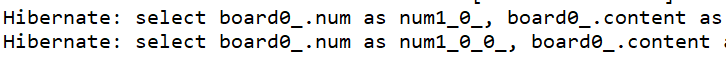

# spring_blog

## 1. 환경설정
- security, security-taglibs, mysql, data-jpa 주석처리

## 2. 프로젝트 실행
- testController 
- @Controller : 스프링이 com.kimmjen.blog 패키지 이하를 스캔해서 모든 파일을 메모리에 new 하는 것이 아니라 특정 annotation이 붙어있는 클래스 파일들을 new(IoC:역전의제어)해서 스프링 컨테이너에 관리

## 3. MySQL 한글설정 및 연결

---

1. mysql 한글설정
- my.ini(programData-> mysql*)
- mysql 재시작
```mysql
[client]
default-character-set=utf8

[mysql]
default-character-set=utf8

[mysqld]
collation-server = utf8_unicode_ci
init-connect='SET NAMES utf8'
init_connect='SET collation_connection = utf8_general_ci'
character-set-server=utf8
```

2. 한글 설정 확인

```
show variables like 'c%';
```

3. 사용자 생성 및 권한 주기 및 DB 생성

```
-- 유저이름@아이피주소
create user 'cos'@'%' identified by 'cos1234';
-- ON DB이름.테이블명
-- TO 유저이름@아이피주소
GRANT ALL PRIVILEGES ON *.* TO 'cos'@'%';
CREATE DATABASE blog CHARACTER SET utf8 DEFAULT COLLATE utf8_general_ci;
use blog;

```

4. mysql 프로젝트 연결

`src/main/resources/application.properties->application.yml`

```
spring:
    datasource:
        driver-class-name: com.mysql.cj.jdbc.Drvier
        url: jdbc:mysql://localhost:3306/blog?serverTimezone=Asia/Seoul
        username: test02
        password: 1111
```

## 4. Http1.1 요청 방식

1. Postman 설치 및 이용

2. Http 1.1
- get
- post
- delete
- put

3. stateless와 stateful

- stateless : server side에 client와 server의 동작, 상태정보를 저장하지 않는 형태, server의 응답이 client와의 세션 상태와 독립적임.
장점: 서버가 client정보를 저장관리 하지 않으므로 Sacling이 자유로움.
- stateful : server side에 client와 server의 동작, 상태정보를 저장하는 형태, 세션 상태에 기반하여 server의 응답이 달라짐.

[stateless vs stateful](https://5equal0.tistory.com/entry/StatefulStateless-Stateful-vs-Stateless-%EC%84%9C%EB%B9%84%EC%8A%A4%EC%99%80-HTTP-%EB%B0%8F-REST)

4. [MIME 타입](https://developer.mozilla.org/ko/docs/Web/HTTP/Basics_of_HTTP/MIME_types/Common_types)

5. Controller 생성 및 실습
- HttpControllertest 생성
- Get 메서드 : select, 여기서 GetTest(Member m) 방법도 있지만 @RequestParam 사용

- Post 메서드 : insert, 여기서 postTest(String text) , @RequestBody 사용
    
    json { "id":1, "username": "kimmjen"}

- Delete 메서드

- Put 메서드

## 5. Lombok 세팅(Maven)

1. maven

2. lombok
- @Data : 클래스안의 모든 private 필드에 대해 @Getter와 @Setter를 적용하여 세터/게터를 만들어주고 클래스 내에 @ToString 과 @EqualsAndHashCode를 적용하여 메소드를 오버라이드 해주며 @RequiredArgsConstructor를 지정
- @Builder
    - 인자가 많을 경우 쉽고 안전하게 객체를 생성
    - 인자의 순서와 상관없이 객체를 생성
    - 적절한 책임을 이름에 부여하고 가독성 높임
- @AllArgsConstructor : 어노테이션은 모든 필드 값을 파라미터로 받는 생성자를 만들어줌
- @NoArgsConstructor : 어노테이션은 파라미터가 없는 기본 생성자를 생성
- @RequiredArgsConstructor : final 붙은 애들에 대한 constructor 만들어줌, @NonNull 인 필드 값만 파라미터로 받는 생성자
- final 불변성 유지

## 6. yaml 설정

1. [yaml](https://www.inflearn.com/questions/16184) 이란


2. yml 설정( web.xml, root-context.xml, servlet-context.xml의 합본) : application.yml

```
스프링 기본경로
// 스프링 파일 기본 경로 : src/main/resources/static
// 리턴 명을 : /home.html "/" 슬러쉬 를 붙여야함
// 풀경로 : src/main/resources/static/home.html

현재 설정값
springmvc : 
// preifx : /WEB-INF/views/
// suffix : .jsp
// 풀네임 : /WEB-INF/views/test.jsp

```


```
server:
  port: 8000
  servlet:
    context-path: /blog
    encoding:
      charset: UTF-8
      enabled: true
      force: true
    
spring:
  mvc:
    view:
      prefix: /WEB-INF/views/
      suffix: .jsp
      
  datasource:
    driver-class-name: com.mysql.cj.jdbc.Driver
    url: jdbc:mysql://localhost:3306/blog?serverTimezone=Asia/Seoul
    username: cos
    password: cos1234
    
  jpa:
    open-in-view: true
    hibernate:
      ddl-auto: create
      naming:
        physical-strategy: org.hibernate.boot.model.naming.PhysicalNamingStrategyStandardImpl
      use-new-id-generator-mappings: false
    show-sql: true
    properties:
      hibernate.format_sql: true

  jackson:
    serialization:
      fail-on-empty-beans: false
```

(1) jasper
: .jsp 경로를 설정한 이유는 스프링 부트는 기본적으로 jsp 사용이 권장하지 않기 때문에 timeleaf 같은 다른 템플릿 엔진을 사용해야 한다. 하지만 .jsp를 사용하기 위해서는 해당 구조로 폴더 구성을 한 뒤 세팅해야한다.

(2) com.mysql.cj.jdbc.Driver
: datasource의 mysql 드라이버에 cj가 들어간 이유는 mysql 6점대 이상 버전부터는 해당 드라이버를 사용하고 그 이전 드라이버는 js가 없는 com.mysql.jdbc.Driver를 사용

(3) open-in-view

```
org.springframework.orm.hibernate3.support.OpenSessionInViewFilter 클래스
```
: 영속성을 프리젠테이션 계층까지 가져간다. 트랜잭션은 Service계층에서 종료된다. Transaction이 종료된 후에도 Controller의 Session이 close되지 않았기 때문에, 영속 객체는 Persistence 상태를 유지할 수 있으며, 따라서 프록시 객체에 대한 Lazy Loading을 수행할 수 있게 된다.
버전 2.0부터 스프링 부트는 기본적으로 OSIV가 활성화 되었을 때 경고를 발행하므로 프로덕션 시스템에 영향을 주기 전에 문제를 발견 할 수 있다.


서블릿 필터에서 Session을 오픈하고 트랜잭션을 시작하던 전통적인 방식의 Open Session in View 패턴과 달리 SpringMVC에서 제공하는 OpenSessionInViewFilter는 필터 내에서 Session은 오픈하지만 트랜잭션은 시작하지 않는다. 따라서 서블릿 필터 안에서는 커넥션 풀로부터 JDBC커넥션을 얻을 필요가 없다.

```
hibernate.enable_lazy_load_no_trans: true  
```

OSIV를 활성화 하였다면 위에 옵션은 필요 없다. 그리고 OSIV는 스프링 부트가 디폴트로 활성화 하고 있는 옵션이다. 경고를 제거하기 위해 명화갛게 적어준 것.


(3) ddl-auto
- create : 서버 시작시마다 DB초기화
- update : 수정사항만 DB에 반영
- none - DB에 아무런 반영을 하지 않음

(5) Physical-strategy
- org.hibernate.boot.model.naming.PhysicalNamingStrategyStandardImpl
- 엔티티를 만들 때 변수명 그대로 DB에 필드를 만들어 준다.
- org.springframework.boot.orm.jpa.hibernate.SpringPhysicalNamingStrategy
- 엔티티를 만들 때 변수명에 언더스코어를 붙여준다. ex) createDate -> create_date

(6) show-sql : true



(7) use-new-id-generator-mappings: false

: use-new-id-generator-mappings 는 mysql로 말하면 auto_increment 오라클로 말하면 시퀀스를 어떤식으로 사용할지 방식을 결정하는 것인데 false를 하면 jpa가 사용하는 기본 넘버링 전략을 따라가지 않는다는 뜻이고 true를 하면 기본 넘버링 전략을 따라간다는 뜻

(8) jackson: serialization: fail-on-empty-beans : false

: Lazy-loading으로 인해 empty-beans이 생길 수 있다. 너그럽게 빈 객체를 허락해주는 옵션이다.

## 7. 테이블 세팅하기
1. Blog 테이블 만들기(User, Board, Reply)

2. 연관관계 만들기
- @ManyToOne
- @OneToMany
- @OneToOne
- @ManyToMany

: ManyToMany는 사용하지 않음. 서로의 primary key로만 중간 테이블을 생성해주는데, 날짜나 시간 다른 필드들이 필요할 수도 있기 때문에, 직접 중간테이블을 만들고 @OneToMany를 사용.

`Board, User, Reply`
여기서 .yml에서 ddl-auto는 한번 생성 후 update로
```
Hibernate: 
    
    alter table Board 
       drop 
       foreign key FKnwfsptg8pbhl5hnphivfydtpy
Hibernate: 
    
    drop table if exists Board
Hibernate: 
    
    drop table if exists User
Hibernate: 
    
    create table Board (
       id integer not null auto_increment,
        content longtext,
        count integer default 0 not null,
        createDate datetime(6),
        title varchar(100) not null,
        userId integer,
        primary key (id)
    ) engine=InnoDB
Hibernate: 
    
    create table User (
       id integer not null auto_increment,
        createDate datetime(6),
        email varchar(50) not null,
        password varchar(100) not null,
        role varchar(255) default 'user',
        username varchar(30) not null,
        primary key (id)
    ) engine=InnoDB
Hibernate: 
    
    alter table Board 
       add constraint FKnwfsptg8pbhl5hnphivfydtpy 
       foreign key (userId) 
       references User (id)
Hibernate: 
    
    alter table Reply 
       add constraint FKayalcledc3l0g5lt1balg0jwf 
       foreign key (boardId) 
       references Board (id)
Hibernate: 
    
    alter table Reply 
       add constraint FKqnspgy412rv4dfcmv69hsf4px 
       foreign key (userId) 
       references User (id)
```

[연관관계](https://ict-nroo.tistory.com/127)

`연관관계 주의`


3. 더미데이터 insert
- @DynamicInsert inser할 때 null인 필드 제외

4. 더미데이터 select 및 응답

```
User user = userRepository.findById(id).orElseThrow(new Supplier<IllegalArgumentException>() {
			@Override
			public IllegalArgumentException get() {
				return new IllegalArgumentException("해당 사용자가 없습니다.");
			}
		});
```
```
@PageableDefault(size=2, sort="id", direction = Sort.Direction.DESC) Pageable pageable
```

5. 더미데이터 update 

: save 대신 @Transactional을 이용하여 더티체킹

[영속성 컨텍스트와 플러시 이해하기](https://ict-nroo.tistory.com/130)

6. 더미데이터 delete

7. 무한 참조 방지

(1) Entity로 받고 Json직렬화 하기 전에 DTO 생성후 복사 BeanUtils.copyProperties(A, B) 

(2) 처음부터 DTO로 DB에서 받기    

(3) @JsonIgnore

(4) @JsonIgnoreProperties({"board"})    

(5) @JsonBackReference, @JsonManagedReferece  

[JPA Entity를 Json으로 변환할 때 발생하는 문제점과 해결방안](https://dublin-java.tistory.com/32)

## 8. Json 데이터로 통신하기

1. Get요청
: 주소에 데이터를 담아 보낸다. 데이터의 형태는 key=value

2. Post, Put, Delete 요청
: Body에 데이터를 담아 보낸다. 데이터 형태는 json으로 통일하는 것이 좋다.

3. 스프링 컨트롤러의 파싱 전략1
: 스프링 컨트롤러는 key=value 데이터를 자동으로 파싱하여 변수에 담아준다. 가령 get요청은 key=value이고 post요청 중에 x-www-form-urlencoded (form태크를 만들어서 데이터 전송) 시에도 key=value이기 때문에 이러한 데이터는 아래와 같이 함수의 parameter로 받을 수 있다.

```
PostMapping("/home)
public String home(String username, String email) {
  return "home";
}
```

4. 스프링 컨트롤러의 파싱 전략2
: 스프링은 key=value 형태의 데이터를 오브젝트로 파싱해서 받아주는 역할도 한다. 이때 주의 할 점은 setter가 없으면 key=value 데이터를 스프링이 파싱해서 넣어주지 못한다.

```
class User {
  private String username;
  private String password;

  public String getUsername() {
    return username;
  }
  public String getPassword() {
    return password;
  }
  public String setUsername(String username) {
    this.username = username;
  }
  public String setPassword(String password) {
    this.password = password;
  }
}
```

```
PostMapping("/home")
public String home(User user) {
  return "home";
}
```

5. key=value가 아닌 데이터는 어떻게 파싱할까?
: json 데이터나 일반 text데이터는 스프링 컨트롤러에서 받기 위해서는 @RequestBody 어노테이션이 필요하다. 기본 전략이 스프링 컨트롤러는 key=value 데이터를 파싱해서 받아주는 일을 하는데 다른 형태의 데이터 가령 json 같은 데이터는 아래와 같이 생겼다.

```
{
  "username":"kimmjen",
  "password":"1111"
}
```

이런 데이터는 스프링이 파싱해서 오브젝트로 받지 못한다. 그래서 @RequestBody 어노테이션을 붙이면 MessageConverter 클래스를 구현한 Jackson 라이브러리가 발동하면서 json 데이터를 자바 오브젝트로 파싱하여 받아준다.

```
PostMapping("/home")
public String home(@RequestBody User user) {
  return "home";
}
```

6. form 태크로 json 데이터 요청 방법
: key=value 데이터가 아니라 json데이터를 어떻게 전송할 까.

> join.jsp
```jsp
<div class="container">
  <form>
    <div class="form-group">
      <label for="username">유저네임</label>
      <input type="text" id="username">
    </div>
    <div class="form-group">
      <label for="password"></label>
      <input type="password" id="password">
    </div>
    <div class="form-group">
      <label for="email"></label>
      <input type="email" id="email">
    </div>
  </form>
  <button id="join--submit" class="btn btn-primary">회원가입</button>
</div>
<script src="/js/join.js"></script>
```

> join.js
```jsp
<script>
$('#join--submit').on('click', function() {
	var data = {
		username : $('#username').val(),
		password : $('#password').val(),
		email : $('#email').val()
	};

	$.ajax({
		type : 'POST',
		url : '/user/join',
		data : JSON.stringify(data),
		contentType : 'application/json; charset=utf-8',
		dataType : 'json'
	}).done(function(r) {
		if (r.statusCode == 200) {
			console.log(r);
			alert('회원가입 성공');
			location.href = '/user/login';
		} else {
			if (r.msg == '아이디중복') {
				console.log(r);
				alert('아이디가 중복되었습니다.');
			} else {
				console.log(r);
				alert('회원가입 실패');
			}
		}
	}).fail(function(r) {
		var message = JSON.parse(r.responseText);
		console.log((message));
		alert('서버 오류');
	});
});
</script>
```