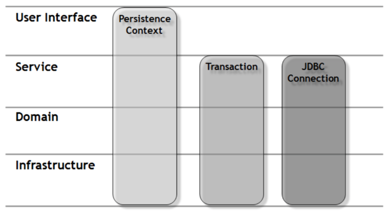

# spring_blog

## 1. 환경설정
- security, security-taglibs, mysql, data-jpa 주석처리

## 2. 프로젝트 실행
- testController 
- @Controller : 스프링이 com.kimmjen.blog 패키지 이하를 스캔해서 모든 파일을 메모리에 new 하는 것이 아니라 특정 annotation이 붙어있는 클래스 파일들을 new(IoC:역전의제어)해서 스프링 컨테이너에 관리

## 3. MySQL 한글설정 및 연결

---

1. mysql 한글설정
- my.ini(programData-> mysql*)
- mysql 재시작
```mysql
[client]
default-character-set=utf8

[mysql]
default-character-set=utf8

[mysqld]
collation-server = utf8_unicode_ci
init-connect='SET NAMES utf8'
init_connect='SET collation_connection = utf8_general_ci'
character-set-server=utf8
```

2. 한글 설정 확인

```
show variables like 'c%';
```

3. 사용자 생성 및 권한 주기 및 DB 생성

```
-- 유저이름@아이피주소
create user 'cos'@'%' identified by 'cos1234';
-- ON DB이름.테이블명
-- TO 유저이름@아이피주소
GRANT ALL PRIVILEGES ON *.* TO 'cos'@'%';
CREATE DATABASE blog CHARACTER SET utf8 DEFAULT COLLATE utf8_general_ci;
use blog;

```

4. mysql 프로젝트 연결

`src/main/resources/application.properties->application.yml`

```
spring:
    datasource:
        driver-class-name: com.mysql.cj.jdbc.Drvier
        url: jdbc:mysql://localhost:3306/blog?serverTimezone=Asia/Seoul
        username: test02
        password: 1111
```

## 4. Http1.1 요청 방식

1. Postman 설치 및 이용

2. Http 1.1
- get
- post
- delete
- put

3. stateless와 stateful

- stateless : server side에 client와 server의 동작, 상태정보를 저장하지 않는 형태, server의 응답이 client와의 세션 상태와 독립적임.
장점: 서버가 client정보를 저장관리 하지 않으므로 Sacling이 자유로움.
- stateful : server side에 client와 server의 동작, 상태정보를 저장하는 형태, 세션 상태에 기반하여 server의 응답이 달라짐.

[stateless vs stateful](https://5equal0.tistory.com/entry/StatefulStateless-Stateful-vs-Stateless-%EC%84%9C%EB%B9%84%EC%8A%A4%EC%99%80-HTTP-%EB%B0%8F-REST)

4. [MIME 타입](https://developer.mozilla.org/ko/docs/Web/HTTP/Basics_of_HTTP/MIME_types/Common_types)

5. Controller 생성 및 실습
- HttpControllertest 생성
- Get 메서드 : select, 여기서 GetTest(Member m) 방법도 있지만 @RequestParam 사용

- Post 메서드 : insert, 여기서 postTest(String text) , @RequestBody 사용
    
    json { "id":1, "username": "kimmjen"}

- Delete 메서드

- Put 메서드

## 5. Lombok 세팅(Maven)

1. maven

2. lombok
- @Data : 클래스안의 모든 private 필드에 대해 @Getter와 @Setter를 적용하여 세터/게터를 만들어주고 클래스 내에 @ToString 과 @EqualsAndHashCode를 적용하여 메소드를 오버라이드 해주며 @RequiredArgsConstructor를 지정
- @Builder
    - 인자가 많을 경우 쉽고 안전하게 객체를 생성
    - 인자의 순서와 상관없이 객체를 생성
    - 적절한 책임을 이름에 부여하고 가독성 높임
- @AllArgsConstructor : 어노테이션은 모든 필드 값을 파라미터로 받는 생성자를 만들어줌
- @NoArgsConstructor : 어노테이션은 파라미터가 없는 기본 생성자를 생성
- @RequiredArgsConstructor : final 붙은 애들에 대한 constructor 만들어줌, @NonNull 인 필드 값만 파라미터로 받는 생성자
- final 불변성 유지

## 6. yaml 설정

1. [yaml](https://www.inflearn.com/questions/16184) 이란


2. yml 설정( web.xml, root-context.xml, servlet-context.xml의 합본) : application.yml

```
스프링 기본경로
// 스프링 파일 기본 경로 : src/main/resources/static
// 리턴 명을 : /home.html "/" 슬러쉬 를 붙여야함
// 풀경로 : src/main/resources/static/home.html

현재 설정값
springmvc : 
// preifx : /WEB-INF/views/
// suffix : .jsp
// 풀네임 : /WEB-INF/views/test.jsp

```


```
server:
  port: 8000
  servlet:
    context-path: /blog
    encoding:
      charset: UTF-8
      enabled: true
      force: true
    
spring:
  mvc:
    view:
      prefix: /WEB-INF/views/
      suffix: .jsp
      
  datasource:
    driver-class-name: com.mysql.cj.jdbc.Driver
    url: jdbc:mysql://localhost:3306/blog?serverTimezone=Asia/Seoul
    username: cos
    password: cos1234
    
  jpa:
    open-in-view: true
    hibernate:
      ddl-auto: create
      naming:
        physical-strategy: org.hibernate.boot.model.naming.PhysicalNamingStrategyStandardImpl
      use-new-id-generator-mappings: false
    show-sql: true
    properties:
      hibernate.format_sql: true

  jackson:
    serialization:
      fail-on-empty-beans: false
```

(1) jasper
: .jsp 경로를 설정한 이유는 스프링 부트는 기본적으로 jsp 사용이 권장하지 않기 때문에 timeleaf 같은 다른 템플릿 엔진을 사용해야 한다. 하지만 .jsp를 사용하기 위해서는 해당 구조로 폴더 구성을 한 뒤 세팅해야한다.

(2) com.mysql.cj.jdbc.Driver
: datasource의 mysql 드라이버에 cj가 들어간 이유는 mysql 6점대 이상 버전부터는 해당 드라이버를 사용하고 그 이전 드라이버는 js가 없는 com.mysql.jdbc.Driver를 사용

(3) open-in-view

```
org.springframework.orm.hibernate3.support.OpenSessionInViewFilter 클래스
```
: 영속성을 프리젠테이션 계층까지 가져간다. 트랜잭션은 Service계층에서 종료된다. Transaction이 종료된 후에도 Controller의 Session이 close되지 않았기 때문에, 영속 객체는 Persistence 상태를 유지할 수 있으며, 따라서 프록시 객체에 대한 Lazy Loading을 수행할 수 있게 된다.
버전 2.0부터 스프링 부트는 기본적으로 OSIV가 활성화 되었을 때 경고를 발행하므로 프로덕션 시스템에 영향을 주기 전에 문제를 발견 할 수 있다.



서블릿 필터에서 Session을 오픈하고 트랜잭션을 시작하던 전통적인 방식의 Open Session in View 패턴과 달리 SpringMVC에서 제공하는 OpenSessionInViewFilter는 필터 내에서 Session은 오픈하지만 트랜잭션은 시작하지 않는다. 따라서 서블릿 필터 안에서는 커넥션 풀로부터 JDBC커넥션을 얻을 필요가 없다.

```
hibernate.enable_lazy_load_no_trans: true  
```

OSIV를 활성화 하였다면 위에 옵션은 필요 없다. 그리고 OSIV는 스프링 부트가 디폴트로 활성화 하고 있는 옵션이다. 경고를 제거하기 위해 명화갛게 적어준 것.


(3) ddl-auto
- create : 서버 시작시마다 DB초기화
- update : 수정사항만 DB에 반영
- none - DB에 아무런 반영을 하지 않음

(5) Physical-strategy
- org.hibernate.boot.model.naming.PhysicalNamingStrategyStandardImpl
- 엔티티를 만들 때 변수명 그대로 DB에 필드를 만들어 준다.
- org.springframework.boot.orm.jpa.hibernate.SpringPhysicalNamingStrategy
- 엔티티를 만들 때 변수명에 언더스코어를 붙여준다. ex) createDate -> create_date

(6) show-sql : true


(7) use-new-id-generator-mappings: false

: use-new-id-generator-mappings 는 mysql로 말하면 auto_increment 오라클로 말하면 시퀀스를 어떤식으로 사용할지 방식을 결정하는 것인데 false를 하면 jpa가 사용하는 기본 넘버링 전략을 따라가지 않는다는 뜻이고 true를 하면 기본 넘버링 전략을 따라간다는 뜻

(8) jackson: serialization: fail-on-empty-beans : false

: Lazy-loading으로 인해 empty-beans이 생길 수 있다. 너그럽게 빈 객체를 허락해주는 옵션이다.

## 7. 테이블 세팅하기
1. Blog 테이블 만들기(User, Board, Reply)

2. 연관관계 만들기
- @ManyToOne
- @OneToMany
- @OneToOne
- @ManyToMany

: ManyToMany는 사용하지 않음. 서로의 primary key로만 중간 테이블을 생성해주는데, 날짜나 시간 다른 필드들이 필요할 수도 있기 때문에, 직접 중간테이블을 만들고 @OneToMany를 사용.

`Board, User, Reply`
여기서 .yml에서 ddl-auto는 한번 생성 후 update로
```
Hibernate: 
    
    alter table Board 
       drop 
       foreign key FKnwfsptg8pbhl5hnphivfydtpy
Hibernate: 
    
    drop table if exists Board
Hibernate: 
    
    drop table if exists User
Hibernate: 
    
    create table Board (
       id integer not null auto_increment,
        content longtext,
        count integer default 0 not null,
        createDate datetime(6),
        title varchar(100) not null,
        userId integer,
        primary key (id)
    ) engine=InnoDB
Hibernate: 
    
    create table User (
       id integer not null auto_increment,
        createDate datetime(6),
        email varchar(50) not null,
        password varchar(100) not null,
        role varchar(255) default 'user',
        username varchar(30) not null,
        primary key (id)
    ) engine=InnoDB
Hibernate: 
    
    alter table Board 
       add constraint FKnwfsptg8pbhl5hnphivfydtpy 
       foreign key (userId) 
       references User (id)
Hibernate: 
    
    alter table Reply 
       add constraint FKayalcledc3l0g5lt1balg0jwf 
       foreign key (boardId) 
       references Board (id)
Hibernate: 
    
    alter table Reply 
       add constraint FKqnspgy412rv4dfcmv69hsf4px 
       foreign key (userId) 
       references User (id)
```

[연관관계](https://ict-nroo.tistory.com/127)

`연관관계 주의`


3. 더미데이터 insert
- @DynamicInsert inser할 때 null인 필드 제외

4. 더미데이터 select 및 응답

```
User user = userRepository.findById(id).orElseThrow(new Supplier<IllegalArgumentException>() {
			@Override
			public IllegalArgumentException get() {
				return new IllegalArgumentException("해당 사용자가 없습니다.");
			}
		});
```
```
@PageableDefault(size=2, sort="id", direction = Sort.Direction.DESC) Pageable pageable
```

5. 더미데이터 update 

: save 대신 @Transactional을 이용하여 더티체킹

[영속성 컨텍스트와 플러시 이해하기](https://ict-nroo.tistory.com/130)

6. 더미데이터 delete

7. 무한 참조 방지

(1) Entity로 받고 Json직렬화 하기 전에 DTO 생성후 복사 BeanUtils.copyProperties(A, B) 

(2) 처음부터 DTO로 DB에서 받기    

(3) @JsonIgnore

(4) @JsonIgnoreProperties({"board"})    

(5) @JsonBackReference, @JsonManagedReferece  

[JPA Entity를 Json으로 변환할 때 발생하는 문제점과 해결방안](https://dublin-java.tistory.com/32)

## 8. Json 데이터로 통신하기

1. Get요청(select)
: 주소에 데이터를 담아 보낸다. 데이터의 형태는 key=value

2. Post, Put, Delete 요청(데이터를 변경)
: Body에 데이터를 담아 보낸다. 데이터 형태는 json으로 통일하는 것이 좋다.
- username, password, email, address, gender, createDate
- form태그 method = 'Post'
- form태그 -> get요청, post요청(key =value)
- 자바스크립트로 요청을 해야함.

- 통일 : 자바스크립트로 ajax요청 + 데이터는 json으로 통일

- form:form 태그 -> get요청, put요청, post요청, delete요청 - 사용x

- 오브젝트로 데이터 받기
post 방식의 key=value(x-www-form-urlencoded)

username  
password

3. 스프링 컨트롤러의 파싱 전략1
: 스프링 컨트롤러는 key=value 데이터를 자동으로 파싱하여 변수에 담아준다. 가령 get요청은 key=value이고 post요청 중에 x-www-form-urlencoded (form태크를 만들어서 데이터 전송) 시에도 key=value이기 때문에 이러한 데이터는 아래와 같이 함수의 parameter로 받을 수 있다.

```
PostMapping("/home)
public String home(String username, String email) {
  return "home";
}
```

4. 스프링 컨트롤러의 파싱 전략2
: 스프링은 key=value 형태의 데이터를 오브젝트로 파싱해서 받아주는 역할도 한다. 이때 주의 할 점은 setter가 없으면 key=value 데이터를 스프링이 파싱해서 넣어주지 못한다.

```
class User {
  private String username;
  private String password;

  public String getUsername() {
    return username;
  }
  public String getPassword() {
    return password;
  }
  public String setUsername(String username) {
    this.username = username;
  }
  public String setPassword(String password) {
    this.password = password;
  }
}
```

```
PostMapping("/home")
public String home(User user) {
  return "home";
}
```

5. key=value가 아닌 데이터는 어떻게 파싱할까?
: json 데이터나 일반 text데이터는 스프링 컨트롤러에서 받기 위해서는 @RequestBody 어노테이션이 필요하다. 기본 전략이 스프링 컨트롤러는 key=value 데이터를 파싱해서 받아주는 일을 하는데 다른 형태의 데이터 가령 json 같은 데이터는 아래와 같이 생겼다.

```
{
  "username":"kimmjen",
  "password":"1111"
}
```

이런 데이터는 스프링이 파싱해서 오브젝트로 받지 못한다. 그래서 @RequestBody 어노테이션을 붙이면 MessageConverter 클래스를 구현한 Jackson 라이브러리가 발동하면서 json 데이터를 자바 오브젝트로 파싱하여 받아준다.

```
PostMapping("/home")
public String home(@RequestBody User user) {
  return "home";
}
```

6. form 태크로 json 데이터 요청 방법
: key=value 데이터가 아니라 json데이터를 어떻게 전송할 까.

> join.jsp
```jsp
<div class="container">
  <form>
    <div class="form-group">
      <label for="username">유저네임</label>
      <input type="text" id="username">
    </div>
    <div class="form-group">
      <label for="password"></label>
      <input type="password" id="password">
    </div>
    <div class="form-group">
      <label for="email"></label>
      <input type="email" id="email">
    </div>
  </form>
  <button id="join--submit" class="btn btn-primary">회원가입</button>
</div>
<script src="/js/join.js"></script>
```

> join.js
```jsp
<script>
$('#join--submit').on('click', function() {
	var data = {
		username : $('#username').val(),
		password : $('#password').val(),
		email : $('#email').val()
	};

	$.ajax({
		type : 'POST',
		url : '/user/join',
		data : JSON.stringify(data),
		contentType : 'application/json; charset=utf-8',
		dataType : 'json'
	}).done(function(r) {
		if (r.statusCode == 200) {
			console.log(r);
			alert('회원가입 성공');
			location.href = '/user/login';
		} else {
			if (r.msg == '아이디중복') {
				console.log(r);
				alert('아이디가 중복되었습니다.');
			} else {
				console.log(r);
				alert('회원가입 실패');
			}
		}
	}).fail(function(r) {
		var message = JSON.parse(r.responseText);
		console.log((message));
		alert('서버 오류');
	});
});
</script>
```

## 9. 화면구현

1. 메뉴와 푸터

2. 회원가입 화면

3. 로그인 화면

4. 회원 수정 화면

5. 글 목록 화면(메인화면)

6. 글 상세보기 화면

7. 글 수정 화면

+ Ajax를 사용하는이유 두가지

  (1) 웹 프로그램과 앱 프로그램에서 하나의 서버를 공유해서 사용

  (2) 비동기 통신을 하기 위해서

## 10. DB격리수준

1. MySQL : repreatable read

둘은 select시에 트랜잭션을 걸게 되면 차이가 들어난다. 

PHANTOM READ(데이터가 보였다. 안보였다.) -> 정합성이 깨짐

2. 스프링부트의 트랜잭션

- 세션의 시작은 서블릿이 시작되는 시점 부터 ~ (세션은 영속성 컨텍스트를 포함)

- 트랜잭션의 시작은 서비스 레이어부터 JDBC 커넥션도 이 시점부터

- 트랜잭션의 종료는 서비스 계층에서 종료, JDBC 커넥션도 이 시점부터 종료

- 세션은 컨트롤러 영역까지 끌고 가기 때문에 영속성이 보장되어 select가 가능해지고, lazy-loading 이 가능해진다.


## 11. 시큐리티 코드짜기.

- [스프링 시큐리티 태그라이브러리](https://www.baeldung.com/spring-security-taglibs)

- [스프링 시큐리티 태그라이브러리 - 메뉴얼](https://docs.spring.io/spring-security/site/docs/3.0.x/reference/el-access.html)

pom.xml에서 주석처리 하였던 시큐리티 관련 주석해체

org.kimmjen.blog.config이하 파일 생성

주소 세팅
- / (컨텍스트 삭제)
- /auth/joinProc
- /auth/loginProc
- /auth/joinForm
- /auth/loginForm

- auth 붙이는 이유: 인증이 안된 사용자들이 출입할 수 있는 경로를 /auth/** 허용, 그냥 주소가 / 이면 index.jsp 허용, static 이하의 `/js/*`, `/css/*`, `/image/*`

```jsp
header.jsp
joinForm.jsp
user.js
UserApiController.java
UserController.java
```

**SecurityConfig.java**

로그인 페이지 커스터마이징

```java
import org.springframework.context.annotation.Configuration;
import org.springframework.security.config.annotation.method.configuration.EnableGlobalMethodSecurity;
import org.springframework.security.config.annotation.web.builders.HttpSecurity;
import org.springframework.security.config.annotation.web.configuration.EnableWebSecurity;
import org.springframework.security.config.annotation.web.configuration.WebSecurityConfigurerAdapter;
import org.springframework.security.config.annotation.web.servlet.configuration.EnableWebMvcSecurity;


@Configuration // 빈 등록 (객체 생성)
@EnableWebSecurity // 필터 체인에 등록 (스프링 시큐리티 활성화)
@EnableGlobalMethodSecurity(prePostEnabled=true) // 특정 주소 접근시 권한 및 인증을 pre(미리) 체크하겠다.
public class SecurityConfig extends WebSecurityConfigurerAdapter{
	@Override
	protected void configure(HttpSecurity http) throws Exception {
		http
	    .authorizeRequests()
	    .antMatchers("/auth/loginForm", "/auth/joinForm")
	    .permitAll()
	    .anyRequest().authenticated()
	    .and()
	    .formLogin().loginPage("/auth/loginForm");   
	}
}

```

```
1. 주소정리.

2. user.js -> 로그인 관련 js 주석처리

3. user.js -> $.ajax 내에 url: -> auth/joinProc 변경

4. config(설정)패키지 생성,SecurityConfig class 생성(@Configuration : Bean 등록의 의미는 스프링 컨테이너에서 객체를 관리할 수 있게 하는 것,@EnableWebSecurity // 필터를 거는것, @EnableGlobalMethodSecurity(prePostEnabled = true) // 특정 주소로 접근하면 권한및 인증을 미리 체크)

5.
http
.authorizeRequests()	: 요청이 들어오면 요청에 대한 인가
.antMatchers("/auth/**")	: 요청에 대해 확인(joinForm, loginForm)
.permitAll()		: 
.anyRequest()		: 다른 모든 요청은
.authenticated();		: 인증이 되야 가능하다.

6. 앱 실행 후 접근제한 확인.

7.
.and()
.formLogin()
.loginPage("/auth/loginForm");

```

||
|--|
|@Configuration|
|해당 클래스를 Configuration으로 등록|
|@EnableWebSecurity|
|spring Security를 활성화 시킨다.|
|@EnableGlobalMethodSecurity(prePostEnabled=true)|
|Controller에서 특정 페이지에 특정 권한이 있는 유저만 접근을 허용할 경우 @PreAuthorize 어노테이션을 사용하는데, 해당 어노테이션에 대한 설정을 활성화시키는 어노테이션이다.(필수는 아님)|
||

`비밀번호 해쉬`
---

```
비밀번호 해쉬 후 회원가입

1. security config 클래스 생성
 // 해쉬(비밀번호 )
@Bean
public BCryptPasswordEncoder encodePWD() {
return new BCryptPasswordEncoder();
}

2. userserver 클래스에
@Autowired
private BCryptPasswordEncoder encoder;

@Transactional
public void 회원가입(User user) {
	
	String rawPassword = user.getPassword();
	
	String encPassword = encoder.encode(rawPassword);
	user.setPassword(encPassword);
	user.setRole(RoleType.USER);
	userRepository.save(user);
}


3. security config클래스에 
http
		.csrf().disable() // csrf 토큰 비활성화(테스트할때)
			.authorizeRequests()
				.antMatchers("/","/auth/**", "/js/**", "/css/**", "/image/**") //접근
				.permitAll()
				.anyRequest()
				.authenticated()
			.and()
				.formLogin()
				.loginPage("/auth/loginForm");

변경

```

`Security Config`
```java
package org.kimmjen.blog.config;

import org.springframework.context.annotation.Bean;
import org.springframework.context.annotation.Configuration;
import org.springframework.security.config.annotation.method.configuration.EnableGlobalMethodSecurity;
import org.springframework.security.config.annotation.web.builders.HttpSecurity;
import org.springframework.security.config.annotation.web.configuration.EnableWebSecurity;
import org.springframework.security.config.annotation.web.configuration.WebSecurityConfigurerAdapter;
import org.springframework.security.crypto.bcrypt.BCryptPasswordEncoder;

// Bean 등록의 의미는 스프링 컨테이너에서 객체를 관리할 수 있게 하는 것(IoC관리)
@Configuration
// requestController 실행되기 전에 securityconfig이 먼저 실행됨.
@EnableWebSecurity // 필터를 거는것= 스프링 시큐리티가 활성화 되어있는데, 어떤 설정을 해당 파일에서 관리하겠다 라는 뜻.
// 시큐리티 필터가 등록
@EnableGlobalMethodSecurity(prePostEnabled = true) // 특정 주소로 접근하면 권한및 인증을 미리 체크
public class SecurityConfig extends WebSecurityConfigurerAdapter {
	
	// 해쉬(비밀번호)
	@Bean // IoC가 된다. new BCryptPasswordEncoder() 이것은 스프링이 관리한다.
	public BCryptPasswordEncoder encodePWD() {
		
		return new BCryptPasswordEncoder();
	}
	
	@Override
	protected void configure(HttpSecurity http) throws Exception {
		
		http
		.csrf().disable() // csrf 토큰 비활성화(테스트할때)
			.authorizeRequests()
				.antMatchers("/","/auth/**", "/js/**", "/css/**", "/image/**") //접근
				.permitAll()
				.anyRequest()
				.authenticated()
			.and()
				.formLogin()
				.loginPage("/auth/loginForm");
		
	}

}

```
`UserService`

```java
package org.kimmjen.blog.service;


import org.kimmjen.blog.model.RoleType;
import org.kimmjen.blog.model.User;
import org.kimmjen.blog.repository.UserRepository;
import org.springframework.beans.factory.annotation.Autowired;
import org.springframework.security.crypto.bcrypt.BCryptPasswordEncoder;
import org.springframework.stereotype.Service;
import org.springframework.transaction.annotation.Transactional;


// 스프링이 컴포넌트 스캔을 통해서 bean에 등록을 해줌. IOC를 해준다.
@Service
public class UserService {
	
	@Autowired
	private UserRepository userRepository;
	
	@Autowired
	private BCryptPasswordEncoder encoder;
	
	@Transactional
	public void 회원가입(User user) {
		
		String rawPassword = user.getPassword();
		
		String encPassword = encoder.encode(rawPassword);
		user.setPassword(encPassword);
		user.setRole(RoleType.USER);
		userRepository.save(user);
	}
//		t
	
//	@Transactional
//	public void 회원가입(User user) {
//		userRepository.save(user);
//	}
	
	
//		try {
//			userRepository.save(user);
//			
//			return 1;
//			
//		} catch (Exception e) {
//			
//			e.printStackTrace();
//			System.out.println("UserService: 회원가입() : " + e.getMessage());
//			
//		}
//		return -1;
	
//	@Transactional(readOnly = true) // select 할때 트랜잭션 시작, 서비스 종료될 때 트랜잭션 종료(정합성 유지)
//	public User 로그인(User user) {
//		return userRepository.findByUsernameAndPassword(user.getUsername(), user.getPassword());
//	}
//	//@Transactional
//	// public User 로그인(User user) {
//	//	return userRepository.findByUsernameAndPassword(user.getUsername(), user.getPassword());
//	//}
}

```

시큐리티 최종작업
---

`PrincipalDetail.java`
```java
package org.kimmjen.blog.config.auth;

import java.util.ArrayList;
import java.util.Collection;

import org.kimmjen.blog.model.User;
import org.springframework.security.core.GrantedAuthority;
import org.springframework.security.core.userdetails.UserDetails;

import lombok.Data;

// 스프링 시큐리티가 로그인 요청을 가로채서 로그인을 진행하고 완료가 되면 UserDetails 타입의 오브젝트를
// 스프링 시큐리티의 고유한 세션 저장소에 저장을 해준다.
public class PrincipalDetail implements UserDetails{
	private User user; // 콤포지션

	public PrincipalDetail(User user) {
		this.user = user;
	}
	
	@Override
	public String getPassword() {
		return user.getPassword();
	}

	@Override
	public String getUsername() {
		return user.getUsername();
	}

	// 계정이 만료되지 않았는지 리턴한다. (true: 만료안됨)
	@Override
	public boolean isAccountNonExpired() {
		return true;
	}

	// 계정이 잠겨있지 않았는지 리턴한다. (true: 잠기지 않음)
	@Override
	public boolean isAccountNonLocked() {
		return true;
	}

	// 비밀번호가 만료되지 않았는지 리턴한다. (true: 만료안됨)
	@Override
	public boolean isCredentialsNonExpired() {
		return true;
	}

	// 계정이 활성화(사용가능)인지 리턴한다. (true: 활성화)
	@Override
	public boolean isEnabled() {
		return true;
	}
	
	// 계정이 갖고있는 권한 목록을 리턴한다. (권한이 여러개 있을 수 있어서 루프를 돌아야 하는데 우리는 한개만)
	@Override
	public Collection<? extends GrantedAuthority> getAuthorities() {
		
		Collection<GrantedAuthority> collectors = new ArrayList<>();
		collectors.add(()->{ return "ROLE_"+user.getRole();});
		
		return collectors;
	}
	
}
```

`PrincipalDetailService.java`
```java
package org.kimmjen.blog.config.auth;

import org.kimmjen.blog.model.User;
import org.kimmjen.blog.repository.UserRepository;

import org.springframework.beans.factory.annotation.Autowired;
import org.springframework.security.core.userdetails.UserDetails;
import org.springframework.security.core.userdetails.UserDetailsService;
import org.springframework.security.core.userdetails.UsernameNotFoundException;
import org.springframework.stereotype.Service;

@Service // Bean 등록
public class PrincipalDetailService implements UserDetailsService {
	
	@Autowired
	private UserRepository userRepository;
	
	// 스프링이 로그인 요청을 가로챌 때, username, password 변수 2개를 가로채는데
	// password 부분 처리는 알아서 함.
	// username이 DB에 있는지만 확인해주면 됨.
	@Override
	public UserDetails loadUserByUsername(String username) throws UsernameNotFoundException {
		User principal = userRepository.findByUsername(username)
				.orElseThrow(()->{
					return new UsernameNotFoundException("해당 사용자를 찾을 수 없습니다. : "+username);
				});
		return new PrincipalDetail(principal); // 시큐리티의 세션에 유저 정보가 저장이 됨.
	}
}

```

`User.java`
```java
package org.kimmjen.blog.model;

import java.sql.Timestamp;

import javax.persistence.Column;
import javax.persistence.Entity;
import javax.persistence.EnumType;
import javax.persistence.Enumerated;
import javax.persistence.GeneratedValue;
import javax.persistence.GenerationType;
import javax.persistence.Id;

import org.hibernate.annotations.ColumnDefault;
import org.hibernate.annotations.CreationTimestamp;
import org.hibernate.annotations.DynamicInsert;

import lombok.AllArgsConstructor;
import lombok.Builder;
import lombok.Data;
import lombok.NoArgsConstructor;

// ORM -> Java(다른언어) Object를 테이블로 매핑해주는 기술
@Data
@NoArgsConstructor
@AllArgsConstructor
@Builder
@Entity // User 클래스가 MySQL에 테이블이 생성.
//@DynamicInsert // insert 시에 null인 필드를 제외
public class User {
	
	@Id //Primary key
	@GeneratedValue(strategy = GenerationType.IDENTITY) // 프로젝트에서 연결된 DB의 넘버링 전략을 따라간다.
	private int id; // 시퀀스, auto_increment
	 
	@Column(nullable = false, length = 30, unique = true) 
	private String username; // 아이디
	
	@Column(nullable = false, length = 100) // 123456 => 해쉬 (비밀번호 암호화)
	private String password;
	
	@Column(nullable = false, length = 50)
	private String email; // myEmail, my_email

	// @ColumnDefault("user")
	// DB는 RoleType이라는 게 없다.
	@Enumerated(EnumType.STRING)
	private RoleType role; // Enum을 쓰는게 좋다. // ADMIN, USER
	
	// 내가 직접 시간을 넣으려면 Timestamp.valueOf(LocalDateTime.now())
	@CreationTimestamp
	private Timestamp createDate;

//	@Id // Primary Key
//	@GeneratedValue(strategy = GenerationType.IDENTITY) // 프로젝트에서 연결된 DB의 넘버링 전략을 따라간다.
//	// 넘버링 전략
//	private int id; // 시퀸스, auto_increment
//
//	@Column(length = 30, nullable = false, unique = true)
//	private String username; // 아이디
//	@Column(length = 100, nullable = false) // 나중에 해쉬를 이용해 비밀번호 암호화
//	private String password; // 비밀번호
//	@Column(length = 50, nullable = false)
//	private String email; //
//
//	// @ColumnDefault("'user'") // " ' ' "
//	// DB는 RoleType이라는 게 없다.
//	@Enumerated(EnumType.STRING)
//	private RoleType role; // Enum을 쓰는게 좋다. 열걸, USER, MANAGER, ADMIN 1 ~80, 81 ~ 90, 91 ~ 100 이런 느낌
//
//	@CreationTimestamp // 시간이 자동입력
//	private Timestamp createDate; //
//	// private Timestamp updateDate;

}

```

`UserRepository.java`
```java
package org.kimmjen.blog.repository;

import java.util.Optional;

import org.kimmjen.blog.model.User;
import org.springframework.data.jpa.repository.JpaRepository;
import org.springframework.data.jpa.repository.Query;

// DAO
// 자동으로 bean등록이 된다
// @Repository // 생략가능하다.
public interface UserRepository extends JpaRepository<User, Integer> {

	// SELECT * fROM user WHERE username = 1?;
	Optional<User> findByUsername(String username);
	
}

// 시큐리티 적용전 버전
//JPA 네이밍 쿼리
	// SELECT * FROM user WHERE username = ?1 AND password = ?2; 
	// User findByUsernameAndPassword(String username, String password);
	
	//	@Query(value = "SELECT * FROM user WHERE username = ?1 AND password = ?2", nativeQuery = true)
	//	User login(String username, String password);
```

`BoardController.java`
```java
package org.kimmjen.blog.controller;

import org.kimmjen.blog.config.auth.PrincipalDetail;
import org.springframework.beans.factory.annotation.Autowired;
import org.springframework.security.core.annotation.AuthenticationPrincipal;
import org.springframework.stereotype.Controller;
import org.springframework.web.bind.annotation.GetMapping;

@Controller
public class BoardController {
//	
//	@Autowired
//	private PrincipalDetail principal;

	// @AuthenticationPrincipal PrincipalDetail principal
    @GetMapping({"","/"})
    public String index(@AuthenticationPrincipal PrincipalDetail principal) { // 컨트롤러에서 principalDetail session 어떻게 찾나?
    	// WEB-INF/views/index
    	
    	System.out.println("로그인 사용자 아이디: " + principal.getUsername());
        return "index";
    }
}

```

`SecurityConfig.java`
```java
package org.kimmjen.blog.config;

import org.kimmjen.blog.config.auth.PrincipalDetailService;
import org.springframework.beans.factory.annotation.Autowired;
import org.springframework.context.annotation.Bean;
import org.springframework.context.annotation.Configuration;
import org.springframework.security.config.annotation.authentication.builders.AuthenticationManagerBuilder;
import org.springframework.security.config.annotation.method.configuration.EnableGlobalMethodSecurity;
import org.springframework.security.config.annotation.web.builders.HttpSecurity;
import org.springframework.security.config.annotation.web.configuration.EnableWebSecurity;
import org.springframework.security.config.annotation.web.configuration.WebSecurityConfigurerAdapter;
import org.springframework.security.crypto.bcrypt.BCryptPasswordEncoder;

// Bean 등록의 의미는 스프링 컨테이너에서 객체를 관리할 수 있게 하는 것(IoC관리)
@Configuration
// requestController 실행되기 전에 securityconfig이 먼저 실행됨.
@EnableWebSecurity // 필터를 거는것= 스프링 시큐리티가 활성화 되어있는데, 어떤 설정을 해당 파일에서 관리하겠다 라는 뜻.
// 시큐리티 필터가 등록
@EnableGlobalMethodSecurity(prePostEnabled = true) // 특정 주소로 접근하면 권한및 인증을 미리 체크
public class SecurityConfig extends WebSecurityConfigurerAdapter {
	
	@Autowired
	private PrincipalDetailService principalDetailService;
	
	@Bean // IoC가 되요!!
	public BCryptPasswordEncoder encodePWD() {
		return new BCryptPasswordEncoder();
	}
	
	// 시큐리티가 대신 로그인해주는데 password를 가로채기를 하는데
	// 해당 password가 뭘로 해쉬가 되어 회원가입이 되었는지 알아야
	// 같은 해쉬로 암호화해서 DB에 있는 해쉬랑 비교할 수 있음.
	@Override
	protected void configure(AuthenticationManagerBuilder auth) throws Exception {
		auth.userDetailsService(principalDetailService).passwordEncoder(encodePWD());
	}
	
	@Override
	protected void configure(HttpSecurity http) throws Exception {
		http
			.csrf().disable()  // csrf 토큰 비활성화 (테스트시 걸어두는 게 좋음)
			.authorizeRequests()
				.antMatchers("/", "/auth/**", "/js/**", "/css/**", "/image/**")
				.permitAll()
				.anyRequest()
				.authenticated()
			.and()
				.formLogin()
				.loginPage("/auth/loginForm")
				.loginProcessingUrl("/auth/loginProc")
				.defaultSuccessUrl("/"); // 스프링 시큐리티가 해당 주소로 요청오는 로그인을 가로채서 대신 로그인 해준다.
	}
//	@Autowired
//	private PrincipalDetailService principalDetailService;
//	
//	// 해쉬(비밀번호)
//	@Bean // IoC가 된다. new BCryptPasswordEncoder() 이것은 스프링이 관리한다.
//	public BCryptPasswordEncoder encodePWD() {
//		
//		return new BCryptPasswordEncoder();
//	}
//	
//	// 시큐리티가 대신 로그인해주는데 password를 가로채기를 하는데
//	// 해당 password가 뭘로 해쉬가 되어 회원가입이 되었는지 알아야
//	// 같은 해쉬로 암호화해서 DB에 있는 해쉬랑 비교할 수 있음.
//	@Override
//	protected void configure(AuthenticationManagerBuilder auth) throws Exception {
//		
//		auth.userDetailsService(principalDetailService).passwordEncoder(encodePWD());
//	}
//	
//	@Override
//	protected void configure(HttpSecurity http) throws Exception {
//		
//		http
//		.csrf().disable() // csrf 토큰 비활성화(테스트할때)
//			.authorizeRequests()
//				.antMatchers("/","/auth/**", "/js/**", "/css/**", "/image/**") //접근
//				.permitAll()
//				.anyRequest()
//				.authenticated()
//			.and()
//				.formLogin()
//				.loginPage("/auth/loginForm")
//				.loginProcessingUrl("/auth/loginProc") // 스프링시큐리티가 해당 주소로 요청오는 로그인을 가로챈다.
//				.defaultSuccessUrl("/"); //로그인 성공시
////				.failureUrl(null) 로그인실패시
//		
//	}

}

```

이 과정 후 localhost:8000 들어갔지만 principal is null 이 뜰 경우 localhost:8000/blog/auth/loginForm 들어가서 먼저 로그인

## 13. 시큐리티 동작 원리

1. 스프링 MVC request life cycle


2. filter와 Interceptor는 실행 시점이 다른다.

Filter는 WebApplication에 등록 - web.xml  
Interceptor는 Spring의 context에 등록

3. Interceptor와 Filter의 차이

Interceptor는 시큐리티가 나오기 전에 인증, 권한을 체크하는 훌륭한 도구로 사용.

Interceptor는 AOP를 흉내낼 수 있다. handlerMethod를 제공하기 때문에 메서드의 전후 처리가 가능하다.

4. Security

security의 인증 절차는 필터 체인을 거쳐 dispatcherservlet으로 가지 전에 적용된다. 그리고 Security는 필터 체인을 통해서 걸러진 request요청을 Interceptor를 이용해서 전추 처리

5. Security 인증 절차

Security를 통한 로그인은 Authentication 객체의 모험(여행)이라고 생각하면 이해하기 쉽다.


6. [스프링 시큐리티 설정 파일참고](https://bamdule.tistory.com/53)

## 14. 글쓰기 등록

`BoardApiController.java`
```java
package org.kimmjen.blog.controller.api;

import javax.servlet.http.HttpSession;

import org.kimmjen.blog.config.auth.PrincipalDetail;
import org.kimmjen.blog.dto.ResponseDto;
import org.kimmjen.blog.model.Board;
import org.kimmjen.blog.model.RoleType;
import org.kimmjen.blog.model.User;
import org.kimmjen.blog.service.UserService;
import org.kimmjen.blog.service.BoardService;
import org.springframework.beans.factory.annotation.Autowired;
import org.springframework.http.HttpStatus;
import org.springframework.security.core.annotation.AuthenticationPrincipal;
import org.springframework.security.crypto.bcrypt.BCryptPasswordEncoder;
import org.springframework.web.bind.annotation.PostMapping;
import org.springframework.web.bind.annotation.RequestBody;
import org.springframework.web.bind.annotation.RestController;

@RestController
public class BoardApiController {
	
	@Autowired
	private BoardService boardService;
	

	@PostMapping("/auth/board")
	public ResponseDto<Integer> save(@RequestBody Board board, @AuthenticationPrincipal PrincipalDetail principal) {
		
		boardService.글쓰기(board, principal.getUser());
		return new ResponseDto<Integer>(HttpStatus.OK.value(), 1);

	}

}

```

`BoardRepository.java`
```java
package org.kimmjen.blog.repository;

import java.util.Optional;

import org.kimmjen.blog.model.Board;
import org.kimmjen.blog.model.User;
import org.springframework.data.jpa.repository.JpaRepository;
import org.springframework.data.jpa.repository.Query;

// DAO
// 자동으로 bean등록이 된다
// @Repository // 생략가능하다.
public interface BoardRepository extends JpaRepository<Board, Integer> {
	
}

```

`BoardService.java`
```java
package org.kimmjen.blog.service;


import org.kimmjen.blog.model.Board;
import org.kimmjen.blog.model.RoleType;
import org.kimmjen.blog.model.User;
import org.kimmjen.blog.repository.BoardRepository;
import org.kimmjen.blog.repository.UserRepository;
import org.springframework.beans.factory.annotation.Autowired;
import org.springframework.security.crypto.bcrypt.BCryptPasswordEncoder;
import org.springframework.stereotype.Service;
import org.springframework.transaction.annotation.Transactional;


@Service
public class BoardService {
	
	@Autowired
	private BoardRepository boardRepository;
	
	@Transactional
	public void 글쓰기(Board board, User user) { // title, content, count
		
		board.setCount(0);
		board.setUser(user);
		boardRepository.save(board);
	}
}

```

`BoardController.java`
```
package org.kimmjen.blog.controller;

import org.kimmjen.blog.config.auth.PrincipalDetail;
import org.springframework.beans.factory.annotation.Autowired;
import org.springframework.security.core.annotation.AuthenticationPrincipal;
import org.springframework.stereotype.Controller;
import org.springframework.web.bind.annotation.GetMapping;

@Controller
public class BoardController {
//	
//	@Autowired
//	private PrincipalDetail principal;

	// @AuthenticationPrincipal PrincipalDetail principal
//    @GetMapping({"","/"})
//    public String index(@AuthenticationPrincipal PrincipalDetail principal) { // 컨트롤러에서 principalDetail session 어떻게 찾나?
//    	// WEB-INF/views/index
//    	
//    	System.out.println("로그인 사용자 아이디: " + principal.getUsername());
//        return "index";
//    }
    @GetMapping({"","/"})
    public String index() { // 컨트롤러에서 principalDetail session 어떻게 찾나?
    	// WEB-INF/views/index
    	
    	
        return "index";
    }
    // User 권한 필요
    @GetMapping("/board/saveForm")
    public String saveForm() {
    	
    	return "board/saveForm";
    }
}

```

`board.js`
```java
let index = {
	init: function() {
		$("#btn-save").on("click", () => { 
			this.save();
		});
	},

	save: function() {
		let data = {
			title: $("#title").val(),
			content: $("#content").val(),
			// email: $("#email").val()
		};
		$.ajax({

			type: "POST",
			url: "/auth/board",
			data: JSON.stringify(data),
			contentType: "application/json; charset=utf-8",
			dataType: "json" 

		}).done(function(resp) {

			alert("글쓰기가 등록되었습니다.");
			
			location.href = "/";

		}).fail(function(error) {

			alert(JSON.stringify(error));

		});
	}
}

index.init();
```

`saveForm.jsp`
```
<%@ page language="java" contentType="text/html; charset=UTF-8"
	pageEncoding="UTF-8"%>

<%@ include file="../layout/header.jsp"%>

<div class="container" style="margin-top: 30px;">

	<h2>글쓰기</h2>
	<br />
	<form>
		<div class="from-group">
			<label for="title">제목</label>
			<input type="text" class="form-control" placeholder="Enter title" id="title">
		</div>
		<br />
		<div class="from-group">
			<label for="content">내용</label>
			<textarea class="form-control summernote" rows="10" cols="85" id="content"></textarea>
		</div>
		<br/>
		<!-- <div class="from-group">
			<label for="">첨부파일</label> <input type="text" class="form-control">
		</div> -->
		<br />
		<button id="btn-save" class="btn btn-primary">글쓰기</button>
	</form>


</div>
<!-- 썸머노트 script 시작 -->
<!-- $('.summernote').summernote({
  height: 150,   //set editable area's height
  codemirror: { // codemirror options
    theme: 'monokai'
  }
});
 -->
<script>

$('.summernote').summernote({
	placeholder: 'Hello Bootstrap 4',
	tabsize: 2,
	height: 300
});
</script>

<!--썸머노트 script 종료  -->

<script src="../js/board.js"></script>
<%@ include file="../layout/footer.jsp"%>


```

## 15. 글 목록 만들기

- BoardController.java, BoardService.java, BoardApiController.java

- board/ list.jsp, header.jsp

`BoardController.java`
```java
package org.kimmjen.blog.controller;

import org.kimmjen.blog.config.auth.PrincipalDetail;
import org.kimmjen.blog.service.BoardService;
import org.springframework.beans.factory.annotation.Autowired;
import org.springframework.security.core.annotation.AuthenticationPrincipal;
import org.springframework.stereotype.Controller;
import org.springframework.ui.Model;
import org.springframework.web.bind.annotation.GetMapping;

@Controller
public class BoardController {
	
	@Autowired
	private BoardService boardService;
//	
//	@Autowired
//	private PrincipalDetail principal;

	// @AuthenticationPrincipal PrincipalDetail principal
//    @GetMapping({"","/"})
//    public String index(@AuthenticationPrincipal PrincipalDetail principal) { // 컨트롤러에서 principalDetail session 어떻게 찾나?
//    	// WEB-INF/views/index
//    	
//    	System.out.println("로그인 사용자 아이디: " + principal.getUsername());
//        return "index";
//    }
    @GetMapping({"","/"})
    public String index() { // 컨트롤러에서 principalDetail session 어떻게 찾나?
    	
    	
    	// WEB-INF/views/index
        return "index";
    }
    
    // User 권한 필요
    @GetMapping("/board/saveForm")
    public String saveForm() {
    	
    	return "board/saveForm";
    }
    
 // User 권한 필요
    @GetMapping("/board/list")
    public String list(Model model) {
    	
    	model.addAttribute("boards", boardService.글목록());
    	return "board/list";
    }
}

```

`BoardService.java`
```java
package org.kimmjen.blog.service;


import java.util.List;

import org.kimmjen.blog.model.Board;
import org.kimmjen.blog.model.RoleType;
import org.kimmjen.blog.model.User;
import org.kimmjen.blog.repository.BoardRepository;
import org.kimmjen.blog.repository.UserRepository;
import org.springframework.beans.factory.annotation.Autowired;
import org.springframework.security.crypto.bcrypt.BCryptPasswordEncoder;
import org.springframework.stereotype.Service;
import org.springframework.transaction.annotation.Transactional;


@Service
public class BoardService {
	
	@Autowired
	private BoardRepository boardRepository;
	
	@Transactional
	public void 글쓰기(Board board, User user) { // title, content, count
		
		board.setCount(0);
		board.setUser(user);
		boardRepository.save(board);
	}
	
	public List<Board> 글목록() {
		
		return boardRepository.findAll();
	}
}

```

`BoardApiController.java`
```java
package org.kimmjen.blog.controller.api;

import javax.servlet.http.HttpSession;

import org.kimmjen.blog.config.auth.PrincipalDetail;
import org.kimmjen.blog.dto.ResponseDto;
import org.kimmjen.blog.model.Board;
import org.kimmjen.blog.model.RoleType;
import org.kimmjen.blog.model.User;
import org.kimmjen.blog.service.UserService;
import org.kimmjen.blog.service.BoardService;
import org.springframework.beans.factory.annotation.Autowired;
import org.springframework.http.HttpStatus;
import org.springframework.security.core.annotation.AuthenticationPrincipal;
import org.springframework.security.crypto.bcrypt.BCryptPasswordEncoder;
import org.springframework.web.bind.annotation.PostMapping;
import org.springframework.web.bind.annotation.RequestBody;
import org.springframework.web.bind.annotation.RestController;

@RestController
public class BoardApiController {
	
	@Autowired
	private BoardService boardService;
	

	@PostMapping("/auth/board")
	public ResponseDto<Integer> save(@RequestBody Board board, @AuthenticationPrincipal PrincipalDetail principal) {
		
		boardService.글쓰기(board, principal.getUser());
		return new ResponseDto<Integer>(HttpStatus.OK.value(), 1);

	}

}

```

`list.jsp`
```java
<%@ page language="java" contentType="text/html; charset=UTF-8"
	pageEncoding="UTF-8"%>
<%@ include file="../layout/header.jsp"%>

<div class="container">

		<h2>목록</h2>
		<table class="table">
			<thead class="thead-dark">
				<tr>
					<th>Title</th>
					<th>Content</th>
					<th>count</th>
					<th>CreateDate</th>
				</tr>
			</thead>
		<c:forEach var="board" items="${boards }">
			<tbody>
				<tr>
					<td>${board.title}</td>
					<td>${board.content}</td>
					<td>${board.count}</td>
					<td>${board.createDate}</td>
				</tr>
			</tbody>
		</c:forEach>
	</table>
</div>
<%@ include file="../layout/footer.jsp"%>


```

## 16. 글목록 페이징, 상세보기, 글 수정

- 글 목록 페이징
- 글 상세보기
- 글 수정

`BoardController.java`
```java
package org.kimmjen.blog.controller;

import org.kimmjen.blog.config.auth.PrincipalDetail;
import org.kimmjen.blog.service.BoardService;
import org.springframework.beans.factory.annotation.Autowired;
import org.springframework.data.domain.Pageable;
import org.springframework.data.domain.Sort;
import org.springframework.data.web.PageableDefault;
import org.springframework.security.core.annotation.AuthenticationPrincipal;
import org.springframework.stereotype.Controller;
import org.springframework.ui.Model;
import org.springframework.web.bind.annotation.GetMapping;
import org.springframework.web.bind.annotation.PathVariable;

@Controller
public class BoardController {

	@Autowired
	private BoardService boardService;
//	
//	@Autowired
//	private PrincipalDetail principal;

	// @AuthenticationPrincipal PrincipalDetail principal
//    @GetMapping({"","/"})
//    public String index(@AuthenticationPrincipal PrincipalDetail principal) { // 컨트롤러에서 principalDetail session 어떻게 찾나?
//    	// WEB-INF/views/index
//    	
//    	System.out.println("로그인 사용자 아이디: " + principal.getUsername());
//        return "index";
//    }
	@GetMapping({ "", "/" })
	public String index(Model model,
			@PageableDefault(size = 2, sort = "id", direction = Sort.Direction.DESC) Pageable pageable) { // 컨트롤러에서
																											// principalDetail
																											// session
																											// 어떻게 찾나?

		model.addAttribute("boards", boardService.글목록(pageable));
		// WEB-INF/views/index
		return "index";
	}

//    @GetMapping("/board/{id}")
//    public String findById(@PathVariable int id) {
//    	boardService.글상세보기(id);
//    }
	@GetMapping("/board/{id}")
	public String findById(@PathVariable int id, Model model) {
		model.addAttribute("board", boardService.글상세보기(id));

		return "board/detail";
	}

	@GetMapping("/board/{id}/updateForm")
	public String updateForm(@PathVariable int id, Model model) {
		model.addAttribute("board", boardService.글상세보기(id));
		return "board/updateForm";
	}

	// User 권한 필요
	@GetMapping("/board/saveForm")
	public String saveForm() {

		return "board/saveForm";
	}

	// User 권한 필요
//    @GetMapping("/board/list")
//    public String list(Model model, @PageableDefault(size = 2, sort = "id", direction = Sort.Direction.DESC) Pageable pageable) {
//    	
//    	model.addAttribute("boards", boardService.글목록(pageable));
//    	return "board/list";
//    }
}

```

`BoardService.java`
```java
package org.kimmjen.blog.service;

import java.util.List;

import org.kimmjen.blog.model.Board;
import org.kimmjen.blog.model.RoleType;
import org.kimmjen.blog.model.User;
import org.kimmjen.blog.repository.BoardRepository;
import org.kimmjen.blog.repository.UserRepository;
import org.springframework.beans.factory.annotation.Autowired;
import org.springframework.data.domain.Page;
import org.springframework.data.domain.Pageable;
import org.springframework.security.crypto.bcrypt.BCryptPasswordEncoder;
import org.springframework.stereotype.Service;
import org.springframework.transaction.annotation.Transactional;

@Service
public class BoardService {

	@Autowired
	private BoardRepository boardRepository;

	@Transactional
	public void 글쓰기(Board board, User user) { // title, content, count

		board.setCount(0);
		board.setUser(user);
		boardRepository.save(board);
	}

//	public List<Board> 글목록() {
//		
//		return boardRepository.findAll();
//	}

	@Transactional(readOnly = true)
	public Page<Board> 글목록(Pageable pageable) {

		return boardRepository.findAll(pageable);
	}

	@Transactional(readOnly = true)
	public Board 글상세보기(int id) {
		return boardRepository.findById(id).orElseThrow(() -> {
			return new IllegalArgumentException("글 상세보기 실패 : 아이디를 찾을 수 없습니다.");
		});
	}

	@Transactional
	public void 글삭제하기(int id) {
		System.out.println("글삭제가 완료되었습니다." + id);
		boardRepository.deleteById(id);
	}

	@Transactional
	public void 글수정하기(int id, Board requestBoard) {
		Board board = boardRepository.findById(id)
				.orElseThrow(()->{
					return new IllegalArgumentException("글 찾기 실패 : 아이디를 찾을 수 없습니다.");
				}); // 영속화 완료
		board.setTitle(requestBoard.getTitle());
		board.setContent(requestBoard.getContent());
		// 해당 함수로 종료시(Service가 종료될 때) 트랜잭션이 종료됩니다. 이때 더티체킹 - 자동 업데이트가 됨. db flush
	}
}

```

`BoardApiController.java`
```java
package org.kimmjen.blog.controller.api;

import javax.servlet.http.HttpSession;

import org.kimmjen.blog.config.auth.PrincipalDetail;
import org.kimmjen.blog.dto.ResponseDto;
import org.kimmjen.blog.model.Board;
import org.kimmjen.blog.model.RoleType;
import org.kimmjen.blog.model.User;
import org.kimmjen.blog.service.UserService;
import org.kimmjen.blog.service.BoardService;
import org.springframework.beans.factory.annotation.Autowired;
import org.springframework.http.HttpStatus;
import org.springframework.security.core.annotation.AuthenticationPrincipal;
import org.springframework.security.crypto.bcrypt.BCryptPasswordEncoder;
import org.springframework.web.bind.annotation.DeleteMapping;
import org.springframework.web.bind.annotation.PathVariable;
import org.springframework.web.bind.annotation.PostMapping;
import org.springframework.web.bind.annotation.PutMapping;
import org.springframework.web.bind.annotation.RequestBody;
import org.springframework.web.bind.annotation.RestController;

@RestController
public class BoardApiController {
	
	@Autowired
	private BoardService boardService;
	

	@PostMapping("/api/board")
	public ResponseDto<Integer> save(@RequestBody Board board, @AuthenticationPrincipal PrincipalDetail principal) {
		
		boardService.글쓰기(board, principal.getUser());
		return new ResponseDto<Integer>(HttpStatus.OK.value(), 1);

	}
	
	@DeleteMapping("/api/board/{id}")
	public ResponseDto<Integer> deleteById(@PathVariable int id) {
		
		boardService.글삭제하기(id);
		return new ResponseDto<Integer>(HttpStatus.OK.value(), 1);
	}
	
	@PutMapping("/api/board/{id}")
	public ResponseDto<Integer> update(@PathVariable int id, @RequestBody Board board){
		System.out.println("BoardApiController : update : id : "+id);
		System.out.println("BoardApiController : update : board : "+board.getTitle());
		System.out.println("BoardApiController : update : board : "+board.getContent());
		boardService.글수정하기(id, board);
		return new ResponseDto<Integer>(HttpStatus.OK.value(), 1);
	}

}

```

`detail.jsp`
```jsp
<%@ page language="java" contentType="text/html; charset=UTF-8"
	pageEncoding="UTF-8"%>

<%@ include file="../layout/header.jsp"%>

<div class="container" style="margin-top: 30px;">

	<h2>글 상세보기</h2>
	<hr />
	
	<button class="btn btn-secondary" onclick="history.back()">돌아가기</button>
	<c:if test="${board.user.id == principal.user.id }">
		<a href="/board/${board.id }/updateForm" class="btn btn-warning">수정</a>
		<button id="btn-delete" class="btn btn-danger">삭제</button>
	</c:if>
	<br /><br />
	<div>
		글 번호 : <span id="id"><i>${board.id }</i></span>
		작성자 : <span><i>${board.user.username }</i></span>
	</div>
	
	<div>
		<label for="title">제목</label>
		<h3>${board.title}</h3>
	</div>
	<br />
	<div>
		<label for="content">내용</label>
		<div>${board.content }</div>
	</div>
	<br />
	<!-- <div class="from-group">
			<label for="">첨부파일</label> <input type="text" class="form-control">
		</div> -->
	<br />

</div>

<script src="/js/board.js"></script>
<%@ include file="../layout/footer.jsp"%>


```

`updateForm.jsp`
```jsp
<%@ page language="java" contentType="text/html; charset=UTF-8"
	pageEncoding="UTF-8"%>

<%@ include file="../layout/header.jsp"%>

<div class="container">

	<h2>글 수정하기</h2>
	<br />

	<form>
		<input type="hidden" id="id" value="${board.id}" />
		<div class="form-group">
			<input value="${board.title}" type="text" class="form-control"
				placeholder="Enter title" id="title">
		</div>

		<div class="form-group">
			<textarea class="form-control summernote" rows="5" id="content">${board.content}</textarea>
		</div>
	</form>
	<button id="btn-update" class="btn btn-primary">글수정완료</button>
</div>

<script>
  $('.summernote').summernote({
    tabsize: 2,
    height: 300
  });
</script>
<script src="/js/board.js"></script>
<%@ include file="../layout/footer.jsp"%>
```

`index.jsp 수정`
```jsp
<%@ page language="java" contentType="text/html; charset=UTF-8"
	pageEncoding="UTF-8"%>

<%@ include file="layout/header.jsp"%>

<div class="container">

	<c:forEach var="board" items="${boards.content}">
		<div class="card m-2">
			<div class="card-body">
				<h4 class="card-title">${board.title }</h4>
				<a href="/board/${board.id }" class="btn btn-primary">상세보기</a>
			</div>
		</div>
	</c:forEach>
	
	<ul class="pagination justify-content-center">
	
	<c:choose>
		<c:when test="${boards.first }">
			<li class="page-item disable"><a class="page-link" href="?page=${boards.number-1}">Previous</a>
		</c:when>
		<c:otherwise>
			<li class="page-item"><a class="page-link" href="?page=${boards.number-1}">Previous</a>
		</c:otherwise>
	</c:choose>
	
	<c:choose>
		<c:when test="${boards.last }">
			<li class="page-itemdisable"><a class="page-link" href="?page=${boards.number+1}">Next</a>
		</c:when>
		<c:otherwise>
			<li class="page-item-disable"><a class="page-link" href="?page=${boards.number+1}">Next</a>
		</c:otherwise>
	</c:choose>


	<!-- <div class="card m-2">
		<div class="card-body">
			<h4 class="card-title">제목 적는 부분</h4>
			<a href="#" class="btn btn-primary">상세보기</a>
		</div>
	</div>

	<div class="card m-2">
		<div class="card-body">
			<h4 class="card-title">제목 적는 부분</h4>
			<a href="#" class="btn btn-primary">상세보기</a>
		</div>
	</div> -->

</div>

<%@ include file="layout/footer.jsp"%>

```

`board.js`
```javascript
let index = {
	init: function() {
		$("#btn-save").on("click", () => {
			this.save();
		});
		$("#btn-delete").on("click", () => {
			this.deleteById();
		});
		$("#btn-update").on("click", () => {
			this.update();
		});
	},

	save: function() {
		let data = {
			title: $("#title").val(),
			content: $("#content").val(),
			// email: $("#email").val()
		};
		$.ajax({

			type: "POST",
			url: "/api/board",
			data: JSON.stringify(data),
			contentType: "application/json; charset=utf-8",
			dataType: "json"

		}).done(function(resp) {

			alert("글쓰기가 등록되었습니다.");

			location.href = "/";

		}).fail(function(error) {

			alert(JSON.stringify(error));

		});
	},
	deleteById: function() {
		let id = $("#id").text();

		$.ajax({
			type: "DELETE",
			url: "/api/board/" + id,
			dataType: "json"
		}).done(function(resp) {
			alert("삭제가 완료되었습니다.");
			location.href = "/";
		}).fail(function(error) {
			alert(JSON.stringify(error));
		});
	},
	update: function() {
		let id = $("#id").val();

		let data = {
			title: $("#title").val(),
			content: $("#content").val()
		};

		$.ajax({
			type: "PUT",
			url: "/api/board/" + id,
			data: JSON.stringify(data),
			contentType: "application/json; charset=utf-8",
			dataType: "json"
		}).done(function(resp) {
			alert("글수정이 완료되었습니다.");
			location.href = "/";
		}).fail(function(error) {
			alert(JSON.stringify(error));
		});
	}

	/*deleteById: function() {
		
		let id = $("#id").text();
		

		$.ajax({

			type: "DELETE",
			url: "/auth/board/" + id,
			dataType: "json",
			contentType: "application/json; charset=utf-8"

		}).done(function(resp) {

			alert("삭제가 완료되었습니다.");
			
			location.href = "/";

		}).fail(function(error) {

			alert(JSON.stringify(error));

		});
	}*/
	
	/*update: function() {
		
		let id = $("#id").val();
		
		let data = {
			title: $("#title").val(),
			content: $("#content").val(),
			// email: $("#email").val()
		};
		$.ajax({

			type: "PUT",
			url: "/api/board/" + id,
			data: JSON.stringify(data),
			contentType: "application/json; charset=utf-8",
			dataType: "json"

		}).done(function(resp) {

			alert("글 수정이 완료되었습니다.");

			location.href = "/";

		}).fail(function(error) {

			alert(JSON.stringify(error));

		});
	}*/
}

index.init();
```

## 17. 회원수정
- 회원 수정을 통해 DB값만 변경
- session 값까지 변경(spring security)


(1). 회원 수정을 통해 DB값만 변경

`UserController.java`
```java
package org.kimmjen.blog.controller;

import org.springframework.stereotype.Controller;
import org.springframework.web.bind.annotation.GetMapping;

@Controller
public class UserController {
	
	// auth 붙이는 이유 : 인증이 안된 사용자들이 출입할 수 있는 경로를 /auth/** 허용
	// 그녕 주소가 / 이면 index.jsp 허용
	// static 이하에 있는 /js/**, /css/**, /image/**
	@GetMapping("auth/joinForm")
	public String joinForm() {
		
		return "user/joinForm";
	}
	
	@GetMapping("auth/loginForm")
	public String loginForm() {
		
		return "user/loginForm";
	}
	
	@GetMapping("/user/updateForm")
	public String updateForm() {
		return "user/updateForm";
	}

}

```
> GetMapping을 통해 user/updateForm

`UseApiController.java`
```java
package org.kimmjen.blog.controller.api;

import javax.servlet.http.HttpSession;

import org.kimmjen.blog.dto.ResponseDto;
import org.kimmjen.blog.model.RoleType;
import org.kimmjen.blog.model.User;
import org.kimmjen.blog.service.UserService;
import org.springframework.beans.factory.annotation.Autowired;
import org.springframework.http.HttpStatus;
import org.springframework.security.crypto.bcrypt.BCryptPasswordEncoder;
import org.springframework.web.bind.annotation.PostMapping;
import org.springframework.web.bind.annotation.PutMapping;
import org.springframework.web.bind.annotation.RequestBody;
import org.springframework.web.bind.annotation.RestController;

@RestController
public class UserApiController {
	
	@Autowired
	private UserService userService;
	
	// 
	@PostMapping("/auth/joinProc")
	public ResponseDto<Integer> save(@RequestBody User user) {// username, password, email
		
		System.out.println("UserApiController : save 호출됨");
		// 실제로 DB에 insert를 하고 아래에서 return 이 되면 된다.
		
//		String encPassword = 
		
		user.setRole(RoleType.USER);
		userService.회원가입(user);
		
		return new ResponseDto<Integer>(HttpStatus.OK.value(), 1);
		// 자바오브젝트를 JSON으로 변환해서 리턴(Jackson)
	}
	
	@PutMapping("/user")
	// RequestBody를 쓰는이유는 json 파일이용하기 때문에 requestbody가 없으면 key=value값만, x-www-form-urlencoded
	public ResponseDto<Integer> update(@RequestBody User user) {
		
		userService.회원수정(user);
		
		return new ResponseDto<Integer>(HttpStatus.OK.value(), 1);
	}

//	@PostMapping("/api/user")
//	public int save(@RequestBody User user) {
//		
//		System.out.println("UserApiController : save 호출됨");
//		return 1;
//	}
//	@Autowired
//	private HttpSession session;
	
	
//	@PostMapping("/api/user/login")
//	public ResponseDto<Integer> login(@RequestBody User user, HttpSession session) {
//		
//		System.out.println("UserApiController : login 호출됨");
//		
//		User principal = userService.로그인(user); // principal(접근주체)
//		
//		if(principal != null) {
//			session.setAttribute("principal", principal);
//		}
//		
//		return new ResponseDto<Integer>(HttpStatus.OK.value(), 1);
//	}
}

```

> PutMapping을 통해

`UserService.java`
```java
package org.kimmjen.blog.service;


import org.kimmjen.blog.model.RoleType;
import org.kimmjen.blog.model.User;
import org.kimmjen.blog.repository.UserRepository;
import org.springframework.beans.factory.annotation.Autowired;
import org.springframework.security.crypto.bcrypt.BCryptPasswordEncoder;
import org.springframework.stereotype.Service;
import org.springframework.transaction.annotation.Transactional;


// 스프링이 컴포넌트 스캔을 통해서 bean에 등록을 해줌. IOC를 해준다.
@Service
public class UserService {
	
	@Autowired
	private UserRepository userRepository;
	
	@Autowired
	private BCryptPasswordEncoder encoder;
	
	@Transactional
	public void 회원가입(User user) {
		String rawPassword = user.getPassword(); //1234 원문
		String encPassword = encoder.encode(rawPassword); // 해쉬
		user.setPassword(encPassword);
		user.setRole(RoleType.USER);
		userRepository.save(user);
	}
	
	@Transactional
	public void 회원수정(User user) { // 외부로부터 받은 user
		// 수정시에는 영속성 컨텍스트 내의 User 오브젝트를 영속화 시키고, 영속화된 User 오브젝트를 수정
		// select를 해서 User 오브젝트를 DB로부터 가져오는 이유는 영속화를 하기 위해서
		// 영속화를 하면 영속화된 오브젝트를 변경하게 되면 자동으로 DB에 업데이트 값을 자동으로 보내기 때문.
		
		User persistence = userRepository.findById(user.getId()).orElseThrow(() -> {
			return new IllegalArgumentException("회원 찾기 실패");
		});
		String rawPassword = user.getPassword();
		String encPassword = encoder.encode(rawPassword);
		persistence.setPassword(encPassword);
		persistence.setEmail(user.getEmail());
		
		// 위와 같은 함수가 끝이나면 끝날때 회원 수정 함수 종료시라는 것은 서비스가 종료된다는 것과 같다.
		// 서비스 종료시는 트랜잭션이 종료 된다는 것이고 commit 이 자동으로 된다라는 의미.
		// commit이 자동으로 된다는 것은 영속화된 persistence객체의 변화가 감지되면 더티체킹이 되어 변환된 것들을 update문을 날려준다(자동으로)
		
	}
//		t
	
//	@Transactional
//	public void 회원가입(User user) {
//		userRepository.save(user);
//	}
	
	
//		try {
//			userRepository.save(user);
//			
//			return 1;
//			
//		} catch (Exception e) {
//			
//			e.printStackTrace();
//			System.out.println("UserService: 회원가입() : " + e.getMessage());
//			
//		}
//		return -1;
	
//	@Transactional(readOnly = true) // select 할때 트랜잭션 시작, 서비스 종료될 때 트랜잭션 종료(정합성 유지)
//	public User 로그인(User user) {
//		return userRepository.findByUsernameAndPassword(user.getUsername(), user.getPassword());
//	}
//	//@Transactional
//	// public User 로그인(User user) {
//	//	return userRepository.findByUsernameAndPassword(user.getUsername(), user.getPassword());
//	//}
}

```

> 회원 수정

`User.js`
```javascript
let index = {
	init: function() {
		$("#btn-save").on("click", () => { //function(){}, () => {} this를 바인딩하기 위해서!!
			this.save();
		});
		/*$("#btn-login").on("click", () => { //function(){}, () => {} this를 바인딩하기 위해서!!
			this.login();
		});*/
		$("#btn-update").on("click", () => { 
			this.update();
		});
	},

	save: function() {
		//alert('user의 save함수 호출됨');
		let data = {
			username: $("#username").val(),
			password: $("#password").val(),
			email: $("#email").val()
		};
		//console.log(data);

		// ajax 호출시 default가 비동기 호출
		// ajax 통신을 이용해서 3개의 데이터를 json으로 변경하여 insert 요청!!
		// ajax가 통신을 성공하고 서버가 json을 리턴해주면 자동으로 자바 오브젝트로 변환해준다.
		$.ajax({

			type: "POST",
			url: "/auth/joinProc",
			data: JSON.stringify(data), // http body데이터
			contentType: "application/json; charset=utf-8", // body데이터가 어떤 타입인지(MIME)
			dataType: "json" // 요청을 서버로 해서 응답이 왔을 때 기본적으로 모든 것이 문자열 (생긴게 json이라면) => javascript오브젝트로 변경

			// 회원가입 수행 요청(100초 가정)
		}).done(function(resp) {

			alert("회원가입이 완료되었습니다.");
			// console.log(resp);
			location.href = "/";

		}).fail(function(error) {

			alert(JSON.stringify(error));

		});
	},
	
	update: function() {
		
		let data = {
			id: $("#id").val(),
			password: $("#password").val(),
			email: $("#email").val()
		};
		$.ajax({

			type: "PUT",
			url: "/user",
			data: JSON.stringify(data), // http body데이터
			contentType: "application/json; charset=utf-8", // body데이터가 어떤 타입인지(MIME)
			dataType: "json" // 요청을 서버로 해서 응답이 왔을 때 기본적으로 모든 것이 문자열 (생긴게 json이라면) => javascript오브젝트로 변경

			// 회원가입 수행 요청(100초 가정)
		}).done(function(resp) {

			alert("회원수정이 완료되었습니다.");
			// console.log(resp);
			location.href = "/";

		}).fail(function(error) {

			alert(JSON.stringify(error));

		});
	}
	/*login: function() {
		//alert('user의 save함수 호출됨');
		let data = {
			username: $("#username").val(),
			password: $("#password").val(),
		};

		$.ajax({

			type: "POST",
			url: "/api/user/login",
			data: JSON.stringify(data), // http body데이터
			contentType: "application/json; charset=utf-8", // body데이터가 어떤 타입인지(MIME)
			dataType: "json" // 요청을 서버로 해서 응답이 왔을 때 기본적으로 모든 것이 문자열 (생긴게 json이라면) => javascript오브젝트로 변경

			// 회원가입 수행 요청(100초 가정)
		}).done(function(resp) {

			alert("로그인이 완료되었습니다.");
			// console.log(resp);
			location.href = "/";

		}).fail(function(error) {

			alert(JSON.stringify(error));

		});
	}*/
}

index.init();
```

> btn-update

`/user/updateForm.jsp`
```jsp
<%@ page language="java" contentType="text/html; charset=UTF-8" pageEncoding="UTF-8"%>

<%@ include file="../layout/header.jsp"%>

<div class="container">
	<form>
	<input type="hidden" id="id" value="${principal.user.id }" />
		<div class="form-group">
			<label for="username">Username</label> 
			<input type="text" value="${princial.user.username }" class="form-control" placeholder="Enter username" id="username" readonly>
			<!-- readOnly 수정 못하게  -->
		</div>
		
		<div class="form-group">
			<label for="password">Password</label> 
			<input type="password" <%-- value="${princial.user.password }" --%> class="form-control" placeholder="Enter password" id="password">
		</div>
		
		<div class="form-group">
			<label for="email">Email</label> 
			<input type="email" value="${princial.user.email }" class="form-control" placeholder="Enter email" id="email">
		</div>
		
	</form>
	<button id="btn-update" class="btn btn-primary">회원수정완료</button>

</div>

<script src="../js/user.js"></script>
<%@ include file="../layout/footer.jsp"%>

```

> input값과 readOnly를 이용하영 값 변경 안시킴.

(2) session 값까지 변경(spring security)


이 과정은 10번에 해당한다.

그림에 UserDetailService는 내가 만든 [PrincipalDetailService](#시큐리티-최종작업)에해당.

`UserApiController.java`
```java
package org.kimmjen.blog.controller.api;

import javax.servlet.http.HttpSession;

import org.kimmjen.blog.config.auth.PrincipalDetail;
import org.kimmjen.blog.dto.ResponseDto;
import org.kimmjen.blog.model.RoleType;
import org.kimmjen.blog.model.User;
import org.kimmjen.blog.service.UserService;
import org.springframework.beans.factory.annotation.Autowired;
import org.springframework.http.HttpStatus;
import org.springframework.security.authentication.AuthenticationManager;
import org.springframework.security.authentication.UsernamePasswordAuthenticationToken;
import org.springframework.security.core.Authentication;
import org.springframework.security.core.annotation.AuthenticationPrincipal;
import org.springframework.security.core.context.SecurityContext;
import org.springframework.security.core.context.SecurityContextHolder;
import org.springframework.security.crypto.bcrypt.BCryptPasswordEncoder;
import org.springframework.web.bind.annotation.PostMapping;
import org.springframework.web.bind.annotation.PutMapping;
import org.springframework.web.bind.annotation.RequestBody;
import org.springframework.web.bind.annotation.RestController;

@RestController
public class UserApiController {
	
	@Autowired
	private UserService userService;
	
	@Autowired
	private AuthenticationManager authenticationManager;
		
	// 
	@PostMapping("/auth/joinProc")
	public ResponseDto<Integer> save(@RequestBody User user) {// username, password, email
		
		System.out.println("UserApiController : save 호출됨");
		// 실제로 DB에 insert를 하고 아래에서 return 이 되면 된다.
		
//		String encPassword = 
		
		user.setRole(RoleType.USER);
		userService.회원가입(user);
		
		return new ResponseDto<Integer>(HttpStatus.OK.value(), 1);
		// 자바오브젝트를 JSON으로 변환해서 리턴(Jackson)
	}
	
	@PutMapping("/user")
	// RequestBody를 쓰는이유는 json 파일이용하기 때문에 requestbody가 없으면 key=value값만, x-www-form-urlencoded
	public ResponseDto<Integer> update(@RequestBody User user) {
		
		userService.회원수정(user);
		// 트랜잭션이 종료되기 때문에 DB에 값은 변경 되었으나 세션값은 변경되지 않은 상태이기 때문에 직접 session 값설정을 해줘야한다.
		// 세션값 변경 방법.
		
		// 세션등록
		
		Authentication authentication = authenticationManager.authenticate(new UsernamePasswordAuthenticationToken(user.getUsername(), user.getPassword()));
		SecurityContextHolder.getContext().setAuthentication(authentication);
		
		return new ResponseDto<Integer>(HttpStatus.OK.value(), 1);
		// 강제로 세션값 변경해줌 아래 코드
//		Authentication authentication = new UsernamePasswordAuthenticationToken(principal, null, principal.getAuthorities());
//		SecurityContext securityContext = SecurityContextHolder.getContext();
//		securityContext.setAuthentication(authentication);
//		session.setAttribute("SPRING_SECURITY_CONTEXT", securityContext);
//		
//		
	}

//	@PostMapping("/api/user")
//	public int save(@RequestBody User user) {
//		
//		System.out.println("UserApiController : save 호출됨");
//		return 1;
//	}
//	@Autowired
//	private HttpSession session;
	
	
//	@PostMapping("/api/user/login")
//	public ResponseDto<Integer> login(@RequestBody User user, HttpSession session) {
//		
//		System.out.println("UserApiController : login 호출됨");
//		
//		User principal = userService.로그인(user); // principal(접근주체)
//		
//		if(principal != null) {
//			session.setAttribute("principal", principal);
//		}
//		
//		return new ResponseDto<Integer>(HttpStatus.OK.value(), 1);
//	}
}

```

`user.js`
```java
let index = {
	init: function() {
		$("#btn-save").on("click", () => { //function(){}, () => {} this를 바인딩하기 위해서!!
			this.save();
		});
		/*$("#btn-login").on("click", () => { //function(){}, () => {} this를 바인딩하기 위해서!!
			this.login();
		});*/
		$("#btn-update").on("click", () => {
			this.update();
		});
	},

	save: function() {
		//alert('user의 save함수 호출됨');
		let data = {
			username: $("#username").val(),
			password: $("#password").val(),
			email: $("#email").val()
		};
		//console.log(data);

		// ajax 호출시 default가 비동기 호출
		// ajax 통신을 이용해서 3개의 데이터를 json으로 변경하여 insert 요청!!
		// ajax가 통신을 성공하고 서버가 json을 리턴해주면 자동으로 자바 오브젝트로 변환해준다.
		$.ajax({

			type: "POST",
			url: "/auth/joinProc",
			data: JSON.stringify(data), // http body데이터
			contentType: "application/json; charset=utf-8", // body데이터가 어떤 타입인지(MIME)
			dataType: "json" // 요청을 서버로 해서 응답이 왔을 때 기본적으로 모든 것이 문자열 (생긴게 json이라면) => javascript오브젝트로 변경

			// 회원가입 수행 요청(100초 가정)
		}).done(function(resp) {

			alert("회원가입이 완료되었습니다.");
			// console.log(resp);
			location.href = "/";

		}).fail(function(error) {

			alert(JSON.stringify(error));

		});
	},

	update: function() {

		let data = {
			id: $("#id").val(),
			username: $("#username").val(),
			password: $("#password").val(),
			email: $("#email").val()
		};
		$.ajax({

			type: "PUT",
			url: "/user",
			data: JSON.stringify(data), // http body데이터
			contentType: "application/json; charset=utf-8", // body데이터가 어떤 타입인지(MIME)
			dataType: "json" // 요청을 서버로 해서 응답이 왔을 때 기본적으로 모든 것이 문자열 (생긴게 json이라면) => javascript오브젝트로 변경

			// 회원가입 수행 요청(100초 가정)
		}).done(function(resp) {

			alert("회원수정이 완료되었습니다.");
			// console.log(resp);
			location.href = "/";

		}).fail(function(error) {

			alert(JSON.stringify(error));

		});
	}
	/*login: function() {
		//alert('user의 save함수 호출됨');
		let data = {
			username: $("#username").val(),
			password: $("#password").val(),
		};

		$.ajax({

			type: "POST",
			url: "/api/user/login",
			data: JSON.stringify(data), // http body데이터
			contentType: "application/json; charset=utf-8", // body데이터가 어떤 타입인지(MIME)
			dataType: "json" // 요청을 서버로 해서 응답이 왔을 때 기본적으로 모든 것이 문자열 (생긴게 json이라면) => javascript오브젝트로 변경

			// 회원가입 수행 요청(100초 가정)
		}).done(function(resp) {

			alert("로그인이 완료되었습니다.");
			// console.log(resp);
			location.href = "/";

		}).fail(function(error) {

			alert(JSON.stringify(error));

		});
	}*/
}

index.init();
```
> 이전에는 let data에서 username안불러왔지만 여기서는 부름

## 18. 댓글 
- 댓글 디자인
`detail.jsp`
```jsp
<%@ page language="java" contentType="text/html; charset=UTF-8"
	pageEncoding="UTF-8"%>

<%@ include file="../layout/header.jsp"%>

<div class="container" style="margin-top: 30px;">

	<h2>글 상세보기</h2>
	<hr />

	<button class="btn btn-secondary" onclick="history.back()">돌아가기</button>
	<c:if test="${board.user.id == principal.user.id }">
		<a href="/board/${board.id}/updateForm" class="btn btn-warning">수정</a>
		<button id="btn-delete" class="btn btn-danger">삭제</button>
	</c:if>
	<br /> <br />
	<div>
		글 번호 : <span id="id"><i>${board.id}</i></span> 작성자 : <span><i>${board.user.username}</i></span>
	</div>

	<div>
		<label for="title">제목</label>
		<h3>${board.title}</h3>
	</div>
	<br />
	<div>
		<label for="content">내용</label>
		<div>${board.content}</div>
	</div>
	<br />

	<div class="card">

		<div class="card-body">
			<textarea class="form-control" rows="1"></textarea>
		</div>
		<div class="card-footer">
			<button class="btn btn-primary">등록</button>
		</div>
	</div>
	<br />
	<div class="card">
		<div class="header">댓글리스트</div>
		<ul id="comment--box" class="list-group">
			<li id="comment-1"
				class="list-group-item d-flex justify-content-between">
				<div>댓글 내용</div>
				<div class="d-flex">
					<div class="font-italic">작성자 : test01 &nbsp;</div>
					<button>삭제</button>
				</div>
			</li>
		</ul>
	</div>

</div>

<script src="/js/board.js"></script>
<%@ include file="../layout/footer.jsp"%>


```